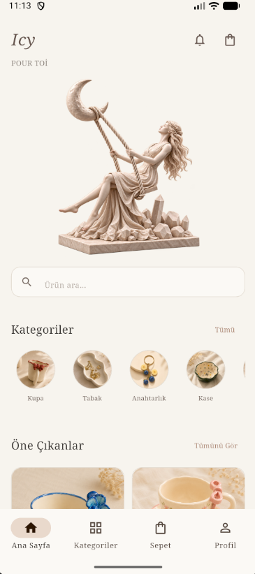
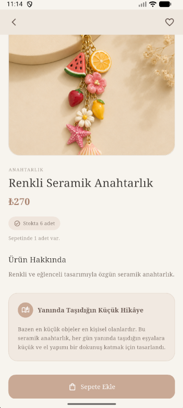
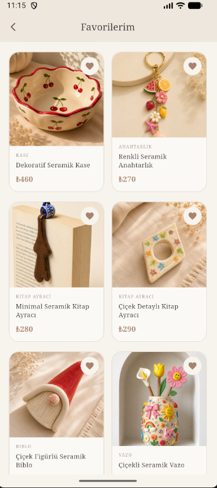
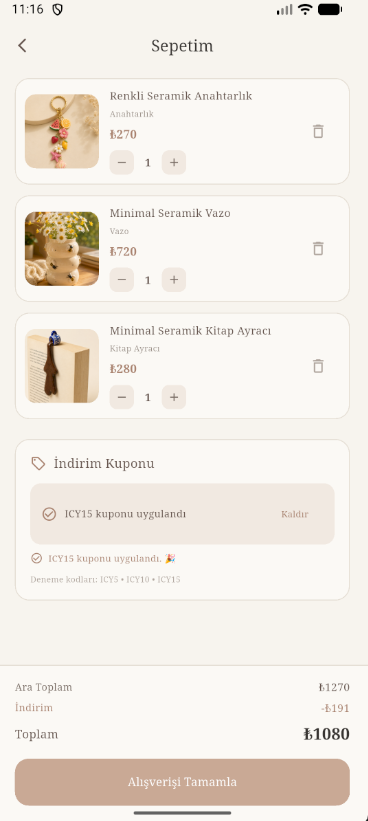
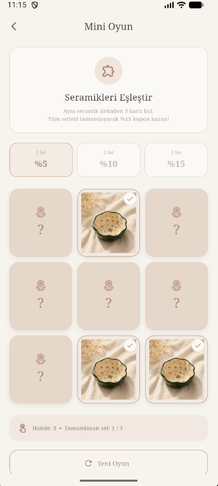
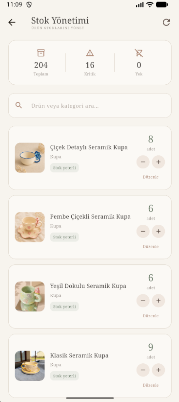
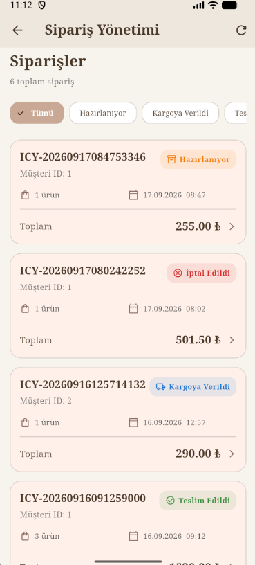
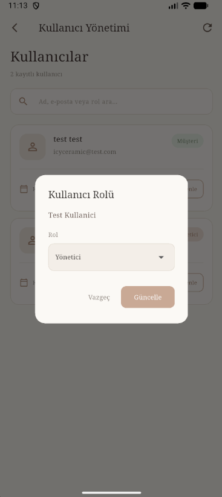

# Icy-Ceramic

A mobile e-commerce application developed for a handmade ceramic products store.

Icy-Ceramic allows customers to browse products, manage their cart and favorites, use discount coupons, place orders, and follow their order status.

The application also includes an administration panel for product, stock, order, and user management.

## Project Overview

Icy-Ceramic was developed as a full-stack mobile e-commerce project using Flutter on the frontend and ASP.NET Core Web API on the backend.

The application uses Entity Framework Core for database operations and Microsoft SQL Server for data storage.

The project follows a client-server architecture where the Flutter application communicates with the backend through REST API endpoints.

## Technologies

### Frontend

- Flutter
- Dart
- Material Design

### Backend

- ASP.NET Core
- C#
- REST API
- Entity Framework Core

### Database

- Microsoft SQL Server

### Tools

- Android Studio
- Visual Studio Code
- Git
- GitHub

## Architecture

```text
Flutter Mobile App
        │
        │ REST API
        ▼
ASP.NET Core Web API
        │
        │ Entity Framework Core
        ▼
Microsoft SQL Server
```

The Flutter application handles the mobile user interface and communicates with the backend through REST API endpoints.

The ASP.NET Core Web API handles business logic, authentication, product operations, orders, stock management, and user management.

Entity Framework Core is used for communication between the application and the SQL Server database.

## Features

### Customer

- User registration and login
- Browse products by category
- View product details
- Add products to cart
- Manage favorites
- Apply discount coupons
- Earn coupons through the mini game
- Manage delivery addresses
- Complete checkout
- Create orders
- View order history
- Track order status

### Admin

- Admin dashboard
- Manage products
- Update product information
- Manage stock quantities
- View and manage orders
- Update order status
- Add cargo company and tracking information
- View registered users
- Manage user roles

## Order and Stock Management

When a customer places an order, the backend checks the available stock before creating the order.

After a successful order:

- The order and order items are saved to the database.
- The product stock is decreased.
- A stock movement record is created.
- The order status is stored and can be updated by an administrator.

The order creation process uses a database transaction to keep these operations consistent.

## Customer Experience

### Home

The home screen provides access to product categories, featured products, search, and the main navigation.

<p align="center">
  
</p>

### Product Detail

The product detail screen displays product information, price, stock status, and product details.

<p align="center">
  
</p>

### Favorites

Customers can save products to their favorites and access them from the favorites screen.

<p align="center">
  
</p>

### Shopping Cart

The shopping cart displays selected products, quantities, applied discounts, and the final order total.

<p align="center">
  
</p>

## Coupons and Rewards

### Mini Game

Customers can play a ceramic-themed matching game and earn discount coupons as rewards.

<p align="center">
  
</p>

### Coupon Wallet

Earned discount coupons are stored in the user's coupon wallet and can be copied and applied during checkout.

<p align="center">
  
</p>

## Admin Panel

The administration panel provides the main management functions of the store.

### Product and Stock Management

Administrators can view product stock levels and update stock quantities when necessary.

<p align="center">
  
</p>

Product information can also be updated through the admin panel, including product name, price, description, and image information.

### Order Management

Administrators can view customer orders, inspect order details, update order status, and manage cargo information.

<p align="center">
  
</p>

### User Management

Administrators can view registered users and manage their assigned roles.

The available roles are:

- Customer
- Admin

<p align="center">
  
</p>

## Database

The application uses Microsoft SQL Server with Entity Framework Core.

The main entities are:

- Users
- Products
- Categories
- Orders
- OrderItems
- CartItems
- Favorites
- Coupons
- Addresses
- StockMovements

These entities support the main e-commerce operations, including product management, shopping carts, orders, user management, coupons, and inventory tracking.

## Project Structure

```text
Icy-Ceramic/
│
├── assets/
│   ├── hero/
│   ├── products/
│   └── screenshots/
│
├── lib/
│   ├── models/
│   ├── screens/
│   └── services/
│
├── backend/
│   └── ICYCeramic.Api/
│       ├── Controllers/
│       ├── Data/
│       ├── Models/
│       └── Services/
│
├── android/
├── ios/
├── pubspec.yaml
└── README.md
```

## Project Purpose

The main purpose of Icy-Ceramic is to develop a mobile e-commerce application while applying practical software engineering concepts.

The project demonstrates:

- Mobile application development
- Client-server architecture
- REST API communication
- Database management
- Entity Framework Core
- CRUD operations
- User authentication
- Role management
- Shopping cart management
- Order management
- Inventory management
- Stock movement tracking
- Coupon management

The architecture also provides a foundation for future ERP integration.

## Project Status

The core customer and administration workflows have been implemented and tested.

The application currently supports customer shopping operations together with product, stock, order, and user management through the admin panel.

## Developer

**Aysima UC**

Computer Engineering Student